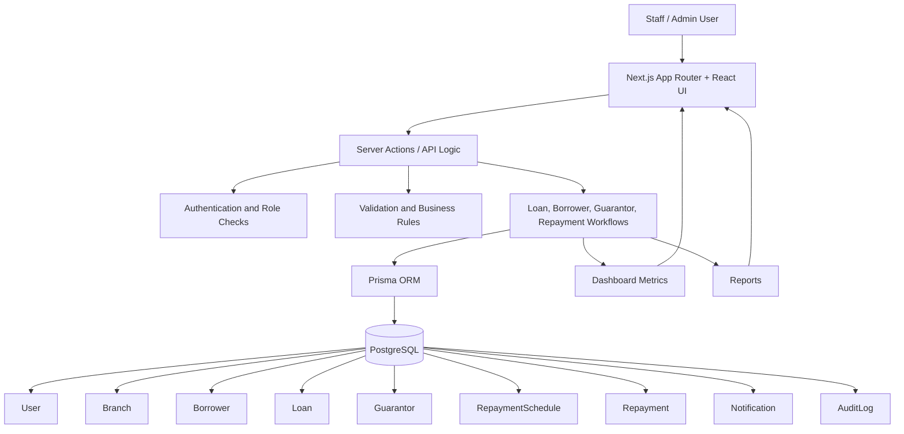

# Architecture

The Trust Company Loan Management System is a Next.js application backed by PostgreSQL through Prisma ORM. It is structured around the operational workflow of a lending business: staff users manage borrowers, loans, guarantors, repayments, branches, reports, notifications, and audit history.

## System Flow

## Main Responsibilities

- **UI layer:** Staff-facing screens for login, dashboard, borrowers, loans, repayments, reports, and settings.
- **Server logic:** Handles secured data access, workflow actions, validation, and business rules.
- **Database layer:** Prisma models represent the lending domain and enforce relational structure.
- **Security layer:** Login, password hashing, staff/admin roles, and production secret configuration.
- **Operational layer:** Deployment checklist, backup/restore guidance, and audit history.

## Core Entities

- `User`: staff and administrator accounts.
- `Branch`: branch-level organization.
- `Borrower`: customer identity, KYC status, contact details, and notes.
- `Loan`: loan amount, interest, officer assignment, branch, status, due date, penalties, and lifecycle.
- `Guarantor`: guarantor details connected to a loan.
- `RepaymentSchedule`: expected repayment dates and amounts.
- `Repayment`: actual repayment records.
- `Notification`: operational notices.
- `AuditLog`: trace of key actions.

## Design Notes

- The system is built around business workflows rather than isolated screens.
- Prisma keeps data access typed and consistent with the schema.
- Role-based access separates administrator and staff responsibilities.
- Reports and dashboard metrics give management visibility into repayment and overdue-loan status.
